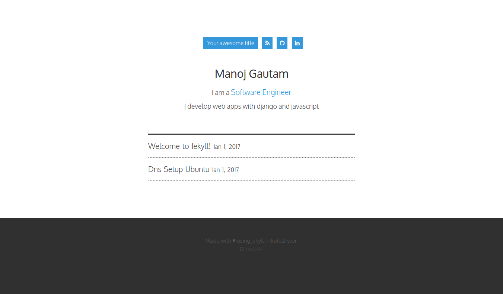

## Jekyll Hilmi V0.1

The jekyll hilmi is just another white clean minimalist jekyll theme that focuses on writing matters. 
Suitable for personal blogs.

[Lime Demo](http://jekyll-hilmi.github.io)

## Installation
1. Fork this repository to your own Github account and then clone in to your local device.
2. Move into the repository director `cd site`
3. Install the dependencies `bundle install` 
4. Run the setup `jekyll server` or `bundle exec jekyll server`

**Screenshot**

## Pull request
- pull request are welcome.

## License
[MIT](./license.md)
